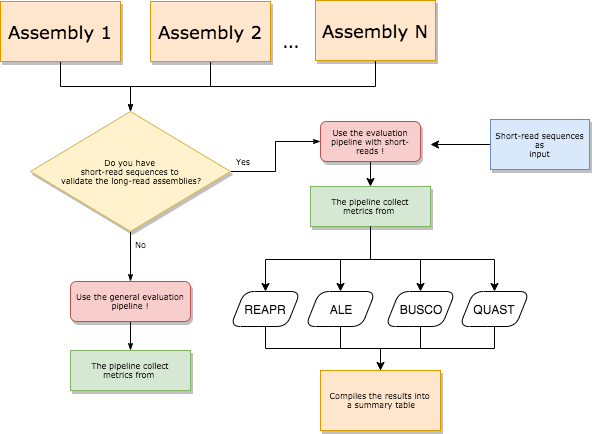

# Snakemake Pipelines

Collection of Bioinformatics pipelines based on [snakemake](https://snakemake.readthedocs.io/en/stable/) workflow management system.

## Implemented pipelines

Up to now we have the following specific pipelines:

- [Pipeline for General Evaluation of Assemblies](https://github.com/rodtheo/snakemake_pipelines/tree/master/evaluate_assemblies): the aim is to execute a collection of tools to generate metrics to evaluate _de novo_ assemblies given that we have a short read paired-end sequence data (fq file) and an assembly to be evaluated (in fasta format). Note that it doesn't require a reference genome, only the set of assemblies that we would like to compare;
- [Pipeline for running ONT Assemblers](https://github.com/rodtheo/snakemake_pipelines/tree/master/ont_assemblers): the aim is to execute most-recent assemblers like Flye and wtdbg2 given as input an Oxford Nanopore Sequence dataset;
- [Pipeline for Evaluation of Plant Assemblies](https://github.com/rodtheo/snakemake_pipelines/tree/master/evaluate_assemblies_plants): this pipeline will use long-reads to assess the quality of a genome assembly. We encourage only the use of corrected long-reads avoiding slightly the error-prone nature of long-reads originated from PacBio or Nanopore sequencers. 

## Which pipeline should I use?

The following diagrams could help to choose which pipeline is more appropriate to set of datas that you have in hands.




## Requirements

- Python 3.4 or later
  - pandas
- Snakemake
- For evaluation pipeline:
  - [REAPR](https://www.sanger.ac.uk/science/tools/reapr)
  - [ALE](https://github.com/sc932/ALE)
  - [BUSCO](https://busco.ezlab.org/)
- For ONT assemby pipeline:
  - [Flye](https://github.com/fenderglass/Flye)
  - [wtdbg2](https://github.com/ruanjue/wtdbg2)

Make sure that all these tools are available in `$PATH`. The links were checked on 03/04/2019.

## Quick usage

In each sub-folder that contains an specific pipeline (e.g. evaluation or ont assembler) we have 3 very important files: `config.yaml`, `samples.tsv` and `Snakefile_<pipeline name>`. These control, respectively, the configuration parameters that will be used during pipeline execution, the input files that will start your analysis and, the third file, defines the pipeline using the snakemake syntax.

Therefore, to execute the pipeline in your data you should only modify the files `config.yaml` and `samples.tsv` filling in the required variables.

After this you should be able to run the pipelines with a simple command.

For example, we can run the general evaluate assembly pipeline with 10 cores using the following command inside the folder `evaluate_assemblies`:

```{bash}
snakemake -s Snakefile_evaluate --cores 10
```

## Background

### Overview of the REAPR algorithm

Two metrics to pinpoint errors:

- Small Local Errors: mapped bases differ from observed in assembled sequence.
- Structural Errors: when the insert/fragment size deviates from expected.

Flag as mis-assembly a region that has no fragment depth or has fragment distribution around a base that causes an FCD error. FCD error at each base of and assembly is defined as the area between the observed and ideal fragment coverage distributions normalized by mean insert size and fragment depth. So, if a base has zero coverage we cannot calculate this metric and the assumption is that this base is an assembly error. If a base is covered by at least 5 uniquely mapped reads and the FCD error <= FCD cutoff it receives a score of 1. In cases where the base fail in some tests it receives a score between 0 and 1 reling on how many tests this base fails. Note that 0 is the worst score.

Outputs:

|   | File                      | Description                                                                      |
|:--|:--------------------------|:---------------------------------------------------------------------------------|
| * | 05.summary.stats.tsv      | Summary spreadsheet produced containing error counts and metrics for each contig |
| * | 05.summary.report.txt/tsv | Summary reporting N50's and error counts and types for whole assembly            |
|   | 04.break.broken_assembly  | REAPR generated new assembly after breaking in errors located in gaps            |
|   | 01.stats.FCDerror.*       | Per base "time series" for each metric (fragment_coverage, FCDerror, ...)        |
|   | 02.fcdrate.*              | File showing which fcd cutoff was selected                                       |
|   | 03.score.errors.*         | The scores for each base or for a region in GFF format                           |

- Fragment Coverage Distribution (FCD): plot of the fragment size (distance between the outermost ends of a proper read pair) depth.


## Quick Usage

First of all, make sure that you have docker and conda (or miniconda) installed in your machine. These softwares will be essential to assist in the installation of the tools that are going to be executed in each pipeline.

For each pipeline we have a particular conda environment and a docker image that must be installed. To clarify, let's execute the pipeline that evaluates a genome assembly given a short read illumina paired-end file. After cloning the corresponding repo, we begin the installation of the pipeline's specific environment and docker image.

To do this, we enter the folder corresponding to the pipeline (`cd evaluate_assemblies`) and create a new conda environment corresponding to our pipeline with the following command:

```
conda env create -f envs/myenv.yaml
```

This will create a conda environment called `evaluate_assemblies`. We can check that the environement was created through `conda info --envs`.

After this, we go to the folder `build_docker_img` and type `docker build -t rodtheo/genomics:eval_assem_ale_reapr .`. This will create an image with the remainer tools required for the execution of pipeline that could not be installed by conda. Again, we can check if the image was created listing them with `docker images`.

Now, we enter our environment using `conda activate evaluate_assemblies` and them we execute the test dataset with `snakemake -s Snakefile_evaluate --cores <number of cores>` where `<number of cores>` must be replaced by a number informing the quantity of cores required by the user.


## Specific Usage

In `evaluate_assembly` folder we put a pipeline that runs the evaluation assembly tools [REAPR](https://doi.org/10.1186/gb-2013-14-5-r47) (Recognition of Errors in Assemblies using Paired Reads), [ALE]() and [BUSCO](). To run please edit the following files:

- Edit **Snakefile_evaluate**: set the path of your configuration file `config.yaml` in configfile variable. An example of configuration file have is show to keep clear the structure and variables in the file.

```{yaml}
workdir: "."
samples: samples.tsv
fq1: fastq/reads_shortinsert_1.fastq
fq2: fastq/reads_shortinsert_2.fastq
threads: 1
```

The most important variables are `samples`, `fq1` and `fq2`. The variable `samples` must store the path of your table of query assemblies. In the example, before running the pipeline we create an file called `samples.tsv` that have two columns separate by a tab. The two columns represent the assembly name (`sample` column) and path to assembly in fasta format (`assembly` column). In the next snippet we can see an example where we have two assemblies performed by tool 1 located in datasets/assembly.fa (path relative to workdir folder) and tool 2 located in datasets/assembly_2.fa. The goal is to evaluate which assembly is better without using reference assembly information.

```
sample	assembly
Assembly_tool_1	datasets/assembly.fa
Assembly_tool_2	datasets/assembly_2.fa
```

So you can declare how many assemblies you want in `samples.tsv` file. After wrote all modifications and edit the table of samples we can run the pipeline through the command:

```
snakemake -s Snakefile_evaluate --cores 10
```

Sometimes when running this pipeline you could encounter and RuleException error.. meaning that you have to fix the fasta header of assembly_2.fa before using it as input to REAPR. The tool REAPR comes with an module to fix the header and save another fasta. So, before running the pipeline please fix the header file with `reapr facheck <in.fa> [out_prefix]`.
